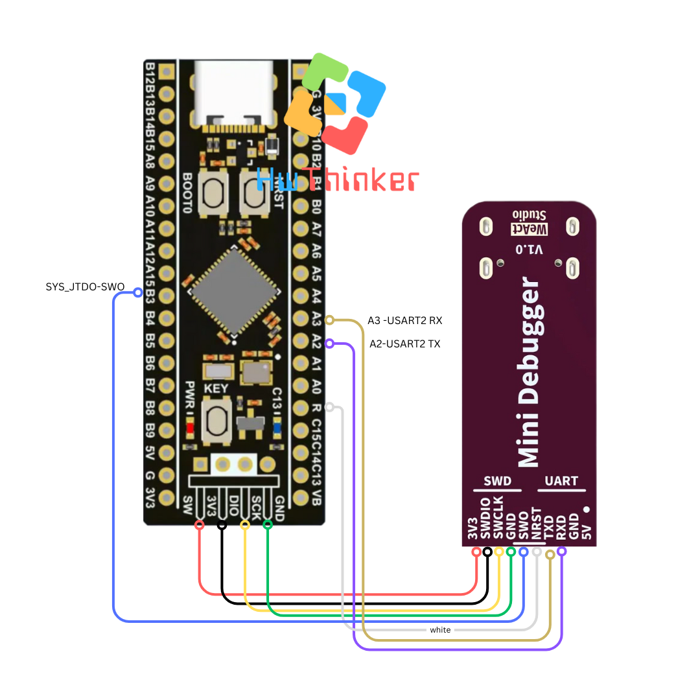
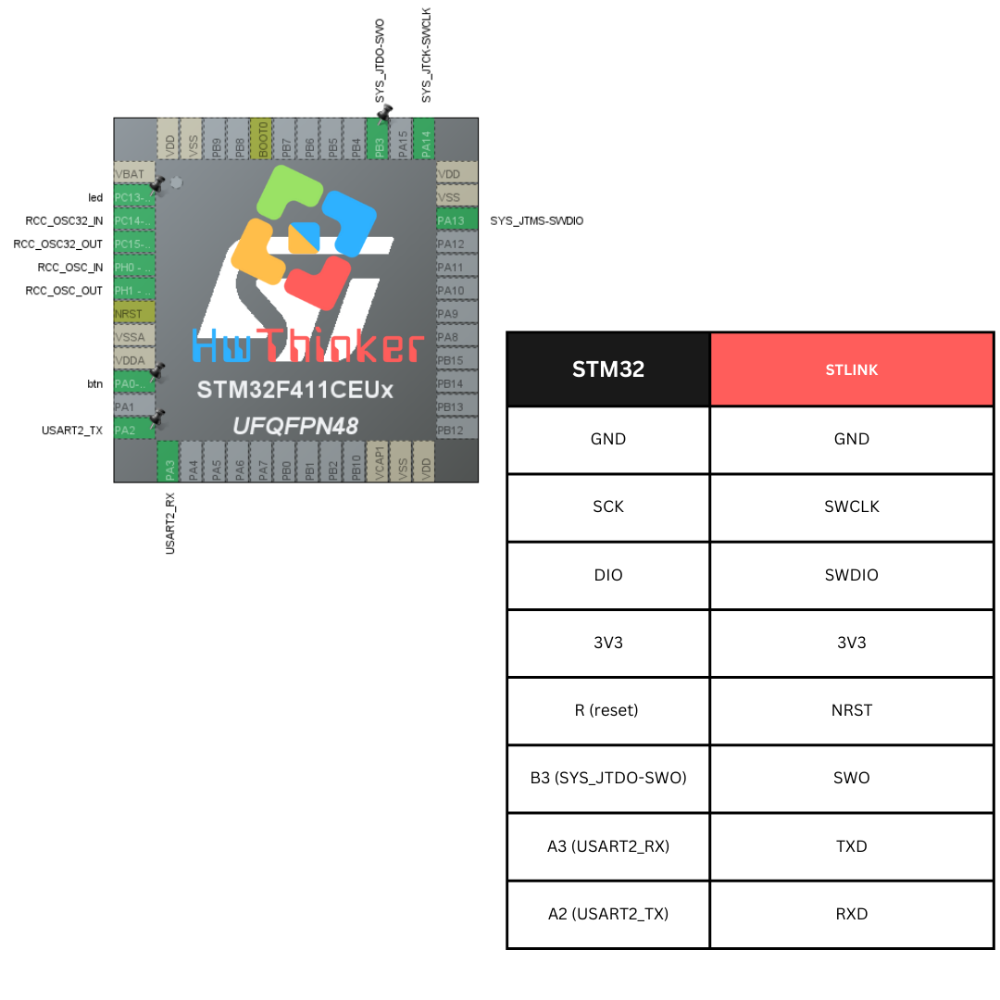
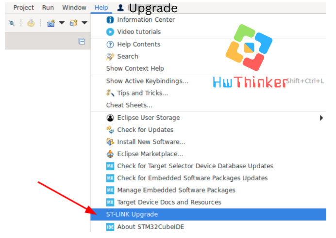
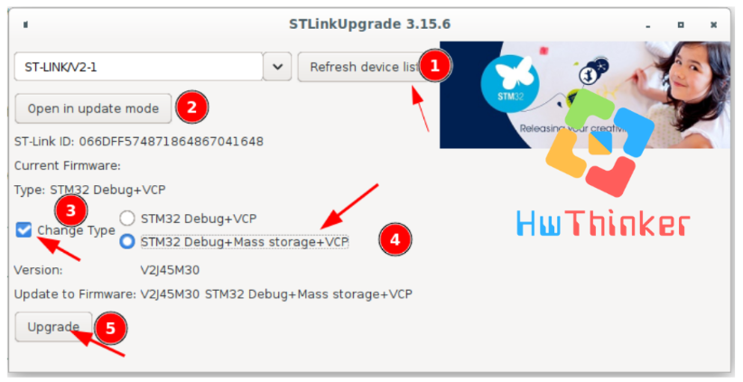
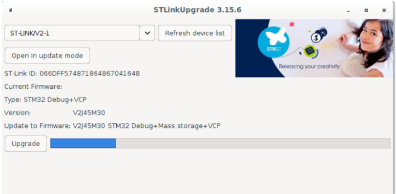
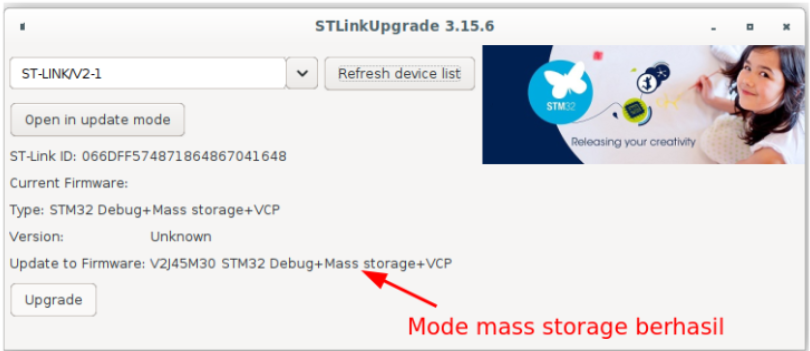

# Wiring connection pada STM32F411CEU6

# Wiring connection pada STM32F411CEU6

****

****

# Cara mengaktifkan konfigurasi mass storage di stlink 2.1

1. Jalankan stm32cube ide
2. Pada menu editor klik Help -> STlink -> Stlink upgrade
     
3. Klik Refresh Device list
4. klik Open in update mode
5. Centang change type
6. Pilih STM32 Debug Mass Storage + VCP
     
7. Klik upgrade

8. Tunggu sampai proses upgrade selesai
    
9. Bila sudah selesai coba klik refresh dan lihat apakah fitur mass storage telah aktif

11. Coba cek di file explorer harusnya terdapat drive mass storage dari stlink

# Cara upload program menggunakan mode mass storage

\- Upload program stm32 yang berupa file intel hexa (*.hex) ke drive tersebut dengan cara copy paste atau drag and drop ke folder tersebut